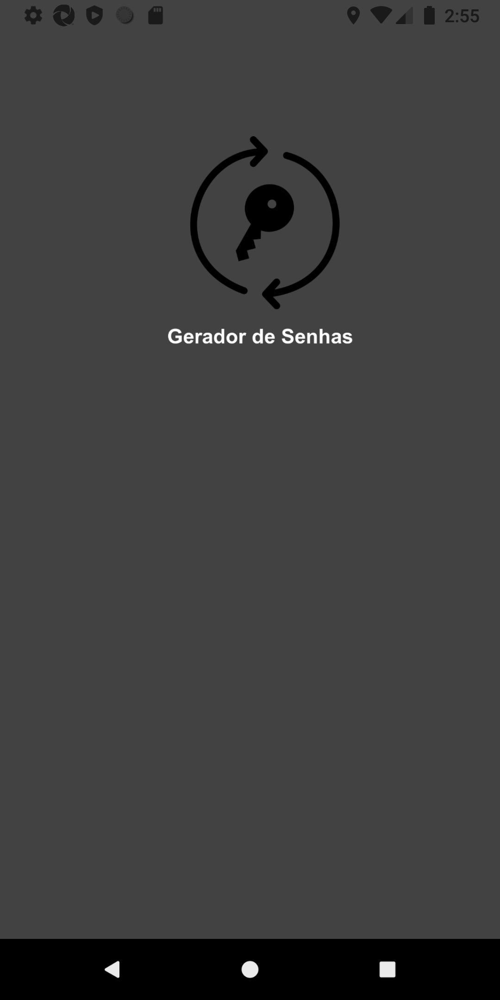

<br />
<p align="center">
  <a href="https://github.com/GabrielPassos25/PasswordGenerator">
    
  </a>

  <h3 align="center">Password Generator</h3>

  <p align="center">
    Create secure passwords with this tool.
  </p>
</p>


<details open="open">
  <summary>Table of Contents</summary>
  <ol>
    <li>
      <a href="#about-the-project">About The Project</a>
      <ul>
        <li><a href="#built-with">Built With</a></li>
      </ul>
    </li>
    <li>
      <a href="#getting-started">Getting Started</a>
      <ul>
        <li><a href="#prerequisites">Prerequisites</a></li>
        <li><a href="#installation">Installation</a></li>
      </ul>
    </li>
    <li><a href="#usage">Usage</a></li>
    <li><a href="#roadmap">Roadmap</a></li>
    <li><a href="#contributing">Contributing</a></li>
    <li><a href="#license">License</a></li>
    <li><a href="#contact">Contact</a></li>
    <li><a href="#acknowledgements">Acknowledgements</a></li>
  </ol>
</details>


## About The Project
This project came about when I was starting to learn react-native. With this, it has the purpose of generating strong passwords to be used on different websites according to the user's preference.

Why using this app?! Here's why:
* Generates unique and secure passwords;
* After closing the app, all passwords are erased, being visible only when using the app
* It's a project made for learning, so it won't be the best of all :smile:

### Built With

* [React-Native](https://reactnative.dev)
* [Expo](https://expo.io)
* [Android-Studio](https://developer.android.com/studio)
* [Node](https://nodejs.org/en/)
* [Yarn](https://yarnpkg.com)

### Installation

1. Clone the repository
   ```sh
   git clone https://github.com/GabrielPassos25/PasswordGenerator.git
   ```

2. Start your emulator (if you are running on an emulator)

2.1. Download expo to your cell phone (to run on your physical device)

3. Start expo server
  ```sh
   expo start
   ```

4. Press a to open app on android emulator.

4.1. Scan the qrcode with the cell phone camera to open the application

5. Use the application :smile:


<!-- USAGE EXAMPLES -->
## Usage

Select how many characters the password should be. When you generate the password, you can save (make a copy) and paste it where you want to save it.
Passwords generated by the application can contain the following characters: abcdefghijklmnopqrstuvwxyzABCDEFGHIJKLMNOPQRSTUVWXYZ1234567890(@#"!^+%&/()=?_-<>#{[]}\|::,;")

##Sreenshots
 <a href="https://github.com/GabrielPassos25/PasswordGenerator">
    
 </a>
